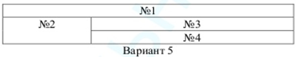

МИНИСТЕРСТВО НАУКИ И ВЫСШЕГО ОБРАЗОВАНИЯ

РОССИЙСКОЙ ФЕДЕРАЦИИ

ФЕДЕРАЛЬНОЕ ГОСУДАРСТВЕННОЕ БЮДЖЕТНОЕ ОБРАЗОВАТЕЛЬНОЕ

УЧРЕЖДЕНИЕ ВЫСШЕГО ОБРАЗОВАНИЯ

«ВЯТСКИЙ ГОСУДАРСТВЕННЫЙ УНИВЕРСИТЕТ»

Институт математики и информационных систем

Факультет автоматики и вычислительной техники

Кафедра систем автоматизации управления

 

Дата сдачи на проверку:

«20» февраля 2021 г.

Проверено:

«__» февраля 2021 г.

Методы формирования html5 документов

Отчет по лабораторной работе № 1

по дисциплине

«Основы frontend-разработки и организации человеко-машинного интерфейса»

Вариант 5

  

Разработал студент гр. ИТб-1303-01-00 ________________ /Панишев Д.А./

Проверил ст. преподаватель _________________ /Земцов М.А./

Работа защищена с оценкой	«___________» «___» __________ 2021 г.

   

Киров 2021  

---

 Цель лабораторной работы: изучение методов формирования html5 документов на стороне клиентов.

 Задачи лабораторной работы:  

1. Организовать рабочее пространство и процессы разработки html5 документов;
2. Изучить структуру html5 документов;
3. Исследовать функциональные возможности инструментов разработчика на стороне браузера;
4. Изучить типовые элементы структуры html5 документа;
5. Составить отчет по выполненным заданиям;
6. Защитить лабораторную работу.

Ход выполнения  

 <b>Задание 1.</b> Организовать рабочее пространство и процессы разработки html5 документов.  

В ходе организации рабочего пространства был установлен текстовый редактор IDE Visual Studio Code, который может быть расширен и адаптирован к языку 
программирования через использование плагинов. Также был установлен перечень плагинов:

- VSCode All Autocomplete
- Auto Close Tag
- Auto Complete Tag
- Auto Rename Tag
- Path Intellisense
- Prettier Formatter for Visual Studio Code vscode-multiclip
- Live Server
- Kite Autocomplete Plugin for Visual Studio Code\*
- GitLens — Git supercharged
- Font Awesome Auto-complete & Preview
- VS Code ESLint extension
- Code Runner
- Bootstrap 4, Font awesome 4, Font Awesome 5 Free & Pro snippets for Visual studio code
- Better Comments
- Visual Studio Code CSS Intellisense for HTML
- Visual Studio Code HTML Snippets  

---
Для использования систем управления версиями необходимо было зарегистрироваться на github.com и изучить документацию по работе с git. Эта задача была успешно выполнена.  

В соответствии с заданием был создан репозиторий «Basic frontend dev labs». В нем создана ветка «lab1». В данной ветке была создана директория «bfsLabs», 
в которую в дальнейшем будет размещаться файлы работ.  

Ссылка на репозиторий: https://github.com/LoXur-ux/Basic-frontend-dev-labs.git  

<b>Задания 2.</b> Изучить структуру html5 документов. Создайте HTML-страницу index4.html, разделенную на фреймы в соответствии с номером варианта. 
В качестве заголовка страницы использовать имя, фамилию и отчество. Фреймы должны содержать (рис. 1):  

№1 – номер зачетной книжки; 

№2 – таблицу (рис.2); 

№3 – ваше имя, отчество и фамилию; 

№4 – список дисциплин и преподавателей текущего семестра.

 
